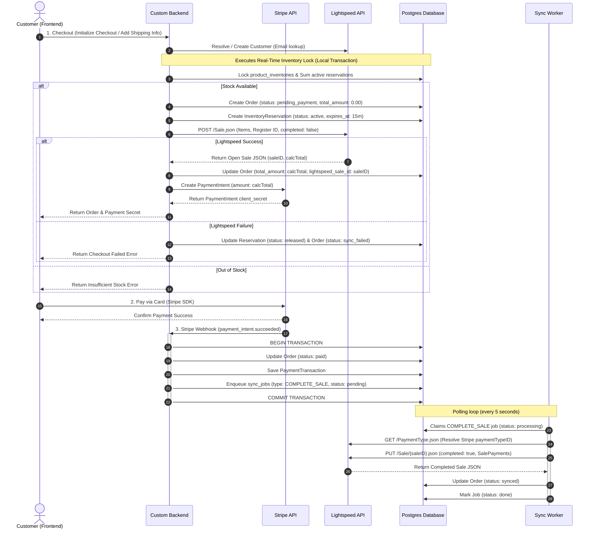

# Lightspeed Retail (R-Series) Payment & Order Sync Flow Plan

This document details the architecture, data models, API payloads, and execution steps for integrating Stripe payments and web orders with the Lightspeed Retail (R-Series) POS.

It integrates official R-Series API constraints, support advice from Samuel Horvath, and specific rules for Customer Resolution and Real-Time Inventory Locking.

---

## 1. Core Integration Decisions

### 1.1 Customer Resolution Flow
To maintain correct customer records and display accurate billing/shipping addresses on physical registers:
1. **Local Search First**: When a user proceeds to checkout (works identically for authenticated users and guest checkouts using the email address they input), search our local `customers` database by email.
2. **Lightspeed Lookup Fallback**: If not found locally, query Lightspeed:
   `GET /Account/{accountID}/Customer.json?email={email}`
   * If found: Save the customer details locally, link their profile, and capture their `lightspeed_customer_id`.
3. **On-Demand Creation**: If the customer does not exist in Lightspeed:
   * Perform a `POST /Account/{accountID}/Customer.json` sending the user's details (email, first/last name, mobile phone number, shipping/billing address).
   * Save the newly created record locally and map their `lightspeed_customer_id`.
4. **Sale Attachment**: Use the resolved `customerID` (string format) when pushing the sale payload.

### 1.2 Lightspeed POS & OAuth Rules
* **OAuth Scopes**: Must request **`employee:register`** and `employee:all` scopes.
* **Virtual Register**: Online sales route to a placeholder register (e.g., "Website Register") on Shop 1. The `registerID` is stored in the database under `lightspeed_configs` (rather than environment variables) so it is runtime-changeable without a server redeployment.
* **Payment Reference & Type ID**: Retrieve the account-specific payment type ID for Stripe/credit card transactions via `GET /PaymentType.json` (caching the ID inside the `lightspeed_configs` table). Store the Stripe **Payment Intent ID** (`pi_...`) as a string in `SalePayment.referenceNumber` to enable easy accounting reconciliations.
* **Two-Step Sale Completion Flow**:
  1. **Create an Open Sale**: Push the sale to Lightspeed with `completed: false` and the sale lines (quantity and unitPrice as strings).
  2. **Read the Calculated Total**: Read the tax and `calcTotal` calculated by Lightspeed (acting as the single source of truth, resolving any differences between local and Lightspeed calculations).
  3. **Authorize via Stripe (Two-Phase Payment)**: Create a Stripe PaymentIntent using `capture_method: 'manual'` to authorize/hold the exact `calcTotal` amount on the customer's card without capturing it.
  4. **Complete and Capture**: Add the payment record to Lightspeed and update the sale to `completed: true`. If the sale successfully completes, call Stripe to **capture** the authorized funds. If it fails (e.g. due to real-time stock collisions), **release** (void) the Stripe authorization. This guarantees the customer is never charged if the POS sale cannot be fulfilled.

---

## 2. Order Sync Architecture

We will implement order syncing using the **Transactional Outbox** pattern. The sequence ensures Lightspeed acts as the source of truth for taxes and totals before any payment is authorized through Stripe.



---

## 3. Real-Time Inventory Validation & Lock Mechanism

### 3.1 Lightspeed Sales vs. Orders
In Lightspeed Retail (R-Series), `Order.json` refers exclusively to purchase orders placed by the business to vendors for stock replenishment. Customer website orders must be represented as a `Sale` (`Sale.json`). No separate records in `Order.json` are needed.

### 3.2 Inventory & Stock Deduction Behavior
* **Automatic Updates**: Inventory updates automatically when a sale is completed in Lightspeed. No separate inventory API requests are required.
* **Open Sale Behavior**: An open sale (`completed: false`) **does not** reduce inventory or hold stock. The quantity is only deducted when the sale changes to `completed: true`. 
* **Overselling Race Conditions**: Because open sales do not reserve stock, the Lightspeed API will not block checkouts when inventory reaches zero. If a register in-store and the website sell the last item concurrently, both sales will complete, driving the Lightspeed quantity on hand (`qoh`) negative.

To minimize overselling, we implement a **4-Tier Inventory Validation & Locking Mechanism**:

### Tier 1: Local Cache Guard (Pre-Filter)
Before initiating checkout, perform a quick check against the local PostgreSQL `product_inventories` table. 

This local cache is synchronized by two separate background pollers running periodically (every 30 seconds):
1. **Catalog Poll (`Item.json?timeStamp=>,{cursor}`)**: Uses cursor `entity_type: 'product'` to fetch parent catalog fields (price, description, categories, and status) which do update the item timestamp when modified in-store.
2. **Inventory Poll (`ItemShop.json?timeStamp=>,{cursor}`)**: Uses a separate cursor `entity_type: 'inventory'` to query `/ItemShop.json` and capture quantity-on-hand (`qoh`) changes from in-store sales (which do not modify the parent `Item.json` timestamp).
   * *Performance Note:* The `/ItemShop.json` query does NOT load the `Item` relation to avoid payload bloat. The worker maps the updated `qoh` using the `itemID` and `shopID` present directly on the `ItemShop` payload.
   * *QOH Aggregation:* Upon writing to `product_inventories`, the worker recalculates the denormalized total `products.qoh` aggregate by summing the shop-level `qoh` values.
   * *Orphaned Inventory Edge Case:* If an inventory update is polled for a brand-new item whose parent record has not yet been synced by the catalog poll, the system logs a debug message and skips it. The nightly `RECONCILE_ALL` sync will catch and resolve it.

If local stock is <= 0, reject checkout immediately without making external API requests.

### Tier 2: Real-Time Lightspeed API Query
If local stock exists, query the live Lightspeed R-Series API:
`GET /Account/{accountID}/Item/{lightspeed_item_id}.json?load_relations=["ItemShops"]`
Verify the real-time stock quantity (`qoh`) specifically for Shop ID 1 (Glen Echo Nurseries location).

### Tier 3: In-Flight Database Reservation Lock
Because Lightspeed open sales (`completed: false`) do not deduct stock or hold inventory, concurrent website checkouts must be restricted by our database-level reservation locks to prevent online users from double-purchasing the same item. 

To prevent rate-limit exhaustion and orphaned open sales on Lightspeed, the flow is structured to perform local reservation checks **before** making the external Lightspeed Sale API call. If local stock is insufficient, the checkout fails immediately without hitting Lightspeed.

$$\text{Effective Stock} = \text{Live Lightspeed QOH} - \sum \text{Quantity in active, non-expired reservations}$$

#### Combined Reservation & Compensation Flow (Sequelize Level)
```typescript
// 1. Fetch live QOH from Lightspeed (crosses network, outside transaction)
const liveQoh = await LightspeedService.getLiveQoh(productId);

let order;
let reservation;

// 2. Local Database Transaction (Fast, executes in microseconds)
await sequelize.transaction(async (t) => {
  // Lock the product inventory row locally to serialize concurrent web requests
  const productInventory = await ProductInventory.findOne({
    where: { product_id: productId, shop_id: 1 },
    lock: t.LOCK.UPDATE,
    transaction: t
  });

  // Calculate local pending reservations (active & non-expired)
  const pendingReservations = await InventoryReservation.sum('quantity', {
    where: {
      product_id: productId,
      status: 'active',
      expires_at: { [Op.gt]: new Date() }
    },
    transaction: t
  }) || 0;

  const effectiveStock = liveQoh - pendingReservations;

  if (effectiveStock < requestedQuantity) {
    throw new Error('INSUFFICIENT_STOCK');
  }

  // Create local Order with placeholder/estimated total_amount (two-phase write)
  order = await Order.create({
    status: 'pending_payment',
    total_amount: 0.00, // placeholder, updated after Lightspeed returns calcTotal
    subtotal_amount: requestedQuantity * productInventory.price,
    tax_amount: 0.00,
    shipping_amount: 0.00
    // ...
  }, { transaction: t });

  // Create the inventory reservation row (valid for 15 minutes to allow for 3DS bank auth delays)
  reservation = await InventoryReservation.create({
    order_id: order.id,
    product_id: productId,
    quantity: requestedQuantity,
    status: 'active',
    expires_at: new Date(Date.now() + 15 * 60 * 1000) // 15 minutes expiration
  }, { transaction: t });
});

// 3. Lightspeed Open Sale Creation (Crosses network, outside transaction)
try {
  const openSale = await LightspeedService.createOpenSale({ customerId, items });

  // Two-phase write: update Order with calculated total and saleID from Lightspeed response
  await order.update({
    total_amount: openSale.calcTotal,
    tax_amount: openSale.taxTotal,
    lightspeed_sale_id: openSale.saleID
  });

  // Initialize Stripe PaymentIntent with the exact calcTotal
  const paymentIntent = await StripeService.createPaymentIntent(openSale.calcTotal);
  await order.update({ stripe_payment_intent: paymentIntent.id });

} catch (error) {
  // Compensating step on failure: release reservation and mark order as failed
  await sequelize.transaction(async (t) => {
    await reservation.update({ status: 'released' }, { transaction: t });
    await order.update({ status: 'sync_failed' }, { transaction: t });
  });
  logger.error('Failed to create open sale on Lightspeed, reservation released.', error);
  throw new Error('CHECKOUT_CREATION_FAILED');
}
```

### Tier 4: In-Store POS Priority Collision Resolution
What if an in-store customer buys the last unit at a physical register while an online customer is typing their card details on Stripe?

To handle this without charging the customer's card and having to process expensive refunds, the system utilizes Stripe's **Authorize & Capture** pattern:
1. **Webhook Authorization**: The Stripe webhook fires when the card authorization succeeds. The backend marks the Order status as `authorized` and enqueues the `COMPLETE_SALE` job.
2. **Worker Pre-Capture Check**: The background worker claims the sync job, and queries the live Lightspeed R-Series API for the item's QOH at Shop 1.
3. **Collision Detection & Resolution**:
   * **Collision (Out of Stock)**: If QOH is <= 0 (indicating an in-store customer bought the last item during the 15-minute checkout window), the worker **voids/releases** the Stripe authorization immediately. The customer is never charged. The worker then voids the open sale on Lightspeed and updates the local order status to `cancelled` (sub-status `stock_collision`), sending an automated "Out of Stock" notification to the customer.
   * **Success (Stock Available)**: If stock is still available, the worker calls the Lightspeed API to update the sale to `completed: true`. If successful, the worker issues a Stripe **capture** request to finalize the charge. The local order status changes to `synced` and the reservation transitions to `consumed`.
This preserves customer trust, avoids transaction fee losses on voids, and eliminates manual reconciliation overhead.

### 3.3 Best Practices implemented to Minimize Overselling
* **Check Stock Before Checkout**: Query live QOH right before initializing the checkout / creating the open sale on Lightspeed.
* **Complete Immediately**: Submit the Lightspeed sale completion payload (`completed: true`) immediately after Stripe payment success is confirmed via Stripe webhooks.
* **Frequent Inventory Refreshes**: Keep website inventory refreshed frequently (every 30 seconds) by polling `/ItemShop.json` to capture in-store sales.
* **Buffer Strategy**: For fast-moving products, consider keeping a small safety buffer (e.g. reserving the last 1 or 2 items for physical register sales).

### 3.4 Read-Only Mode & Asynchronous API Mocking
To permit full integration testing of Stripe payments, webhook processing, database inventory locking, and order fulfillment tracking without altering the live POS dataset, the backend implements a **Conditional API Mocking Strategy** when the database `read_only_mode` config flag is enabled:

1. **Open Sale Creation (`createOpenSale`)**:
   * If `read_only_mode` is `true`, the mock handler bypasses the network call to `POST /Sale.json`.
   * It calculates the total amount locally by applying the 13% Ontario HST on the subtotal:
     $$\text{Mock Total} = \text{Subtotal} \times 1.13$$
   * It returns a mock payload containing:
     * `saleID`: A generated dummy string (e.g. `mock-sale-[uuid]`)
     * `calcTotal`: The computed total string (e.g. `"4.50"`)
     * `taxTotal`: The computed tax string (e.g. `"0.52"`)
2. **Customer Resolution (`resolveCustomer`)**:
   * Bypasses the `POST /Customer.json` API call if not found in the local database.
   * Instead, it generates a dummy customer ID (e.g., `mock-cust-123`) and saves it to the local database, allowing the checkout to proceed.
3. **Sale Completion (`completeSale`)**:
   * Bypasses the network call to `PUT /Sale/{saleID}.json`.
   * Simulates a successful Lightspeed response by returning a mock completion payload, allowing the worker to immediately proceed with the Stripe capture.
4. **Live QOH Checks (`getLiveQoh`)**:
   * Real-time inventory queries (`GET /Item/{id}.json`) are **read-only** and do not alter POS data, so they are executed against the live API even in read-only mode to check actual shop levels.
   * If the API is unreachable or credentials are not yet configured during local developer testing, the service falls back to reading the stock levels from the local `product_inventories` table.

This architecture ensures the entire frontend/backend order flow can be verified end-to-end (including Stripe SDK integration, bank authentication holds, capture jobs, and local database state transitions) with zero changes to live registers.

---

## 4. Database Schema Design (New Local Models)

Three new models will be created in `src/database/models/` to store order records.

### A. Order (`src/database/models/order.model.ts`)
```typescript
id                     UUID           (PK)
user_id                INTEGER        (References User, nullable for guest checkout)
status                 ENUM           ('pending_payment', 'authorized', 'paid', 'sync_failed', 'synced', 'manual_fulfillment_alert', 'cancelled')
total_amount           DECIMAL(10,2)  (Grand total paid)
subtotal_amount        DECIMAL(10,2)  (Items sum before tax)
tax_amount             DECIMAL(10,2)  (Ontario HST at 13%)
shipping_amount        DECIMAL(10,2)  (Optional/nullable shipping fees, defaults to 0.00 since there is no shipping fee currently)
stripe_payment_intent  STRING         (Unique, Stripe Payment Intent ID)
lightspeed_sale_id     STRING         (Nullable, Lightspeed saleID created as completed: false during checkout setup)
lightspeed_ship_to_id  STRING         (Nullable, linked shipToID created during checkout)
shipped_locally        BOOLEAN        (Default: false, derived from POS ShipTo.shipped status)
shipped_at             TIMESTAMP      (Nullable, when order status changes to shipped)
carrier                STRING         (Nullable, carrier name entered in custom backend)
tracking_number        STRING         (Nullable, tracking number entered in custom backend)
estimated_delivery     TIMESTAMP      (Nullable, estimate entered in custom backend)
shipping_address       JSONB          (Formatted shipping address)
billing_address        JSONB          (Formatted billing address)
created_at             TIMESTAMP
updated_at             TIMESTAMP
```

### B. OrderItem (`src/database/models/order-item.model.ts`)
```typescript
id                     INTEGER        (PK, Auto-increment)
order_id               UUID           (References Order)
product_id             INTEGER        (References Product)
quantity               INTEGER
price                  DECIMAL(10,2)  (Price per item when purchased)
discount               DECIMAL(10,2)  (Total discount applied to line)
created_at             TIMESTAMP
updated_at             TIMESTAMP
```

### C. PaymentTransaction (`src/database/models/payment-transaction.model.ts`)
```typescript
id                     INTEGER        (PK, Auto-increment)
order_id               UUID           (References Order)
provider               STRING         ('stripe')
transaction_id         STRING         (Stripe Charge or Payment Intent ID)
amount                 DECIMAL(10,2)
status                 STRING         ('succeeded', 'failed', 'refunded')
raw_response           JSONB          (Full response log)
created_at             TIMESTAMP
updated_at             TIMESTAMP
```

### D. InventoryReservation (`src/database/models/inventory-reservation.model.ts`)
```typescript
id                     INTEGER        (PK, Auto-increment)
order_id               UUID           (References Order)
product_id             INTEGER        (References Product)
quantity               INTEGER
status                 ENUM           ('active', 'consumed', 'released')
expires_at             TIMESTAMP      (Expiration timestamp, set to creation + 15 minutes)
created_at             TIMESTAMP
updated_at             TIMESTAMP
```

---

## 5. Lightspeed API Payload Specifications

Our integration uses a **two-step flow** to ensure tax and fee calculations by Lightspeed match Stripe payment totals exactly.

### 5.1 Step 1: Create Open Sale
When the customer initiates the payment stage, the backend creates an open sale on Lightspeed. This prompts Lightspeed to calculate the final taxes and overall total (`calcTotal`).

* **Endpoint**: `POST https://api.lightspeedapp.com/API/V3/Account/{accountID}/Sale.json`
* **Payload Structure**:
```json
{
  "completed": false,
  "shopID": "1",
  "registerID": "6",
  "employeeID": "1",
  "customerID": "123",
  "ShipTo": {
    "firstName": "John",
    "lastName": "Smith",
    "shipNote": "Ring doorbell",
    "Contact": {
      "Addresses": {
        "ContactAddress": {
          "address1": "123 Main St",
          "city": "Toronto",
          "state": "Ontario",
          "zip": "M1 2AB",
          "country": "Canada",
          "countryCode": "CA"
        }
      },
      "Phones": {
        "ContactPhone": {
          "number": "555-1234",
          "useType": "Mobile"
        }
      },
      "Emails": {
        "ContactEmail": {
          "address": "john@example.com",
          "useType": "Primary"
        }
      }
    }
  },
  "SaleLines": {
    "SaleLine": [
      {
        "itemID": "1284",
        "unitQuantity": "2",
        "unitPrice": "1.99"
      }
    ]
  }
}
```
> [!NOTE]
> We attach the shipping address as an inline `ShipTo` object when creating the sale. Lightspeed will automatically create the record and associate it using `shipToID`.
> 
> *Future Fees:* If website surcharges (such as platform, shipping, or handling fees) are introduced in the future, they must be added as separate non-inventory `SaleLine` entries referencing a pre-configured placeholder `itemID` (e.g. created manually in Lightspeed) so they are included in Lightspeed's total calculation. Do not add fees only to the payment amount.

Lightspeed will calculate Ontario HST (13%) on the taxable items (e.g., $1.99 * 2 = $3.98 subtotal $\rightarrow$ $0.52 HST) and respond with the final `calcTotal` of `"4.50"`. The backend retrieves this `calcTotal` and creates the Stripe PaymentIntent for the exact matching amount.

---

### 5.2 Step 2: Complete the Sale
When Stripe confirms payment success, the background sync worker completes the sale by supplying the payment record.

* **Endpoint**: `PUT https://api.lightspeedapp.com/API/V3/Account/{accountID}/Sale/{saleID}.json`
* **Payload Structure**:
```json
{
  "completed": true,
  "SalePayments": {
    "SalePayment": {
      "paymentTypeID": "3",
      "amount": "4.50",
      "referenceNumber": "pi_3Mxt5EGkHvL1133H00A1A2"
    }
  }
}
```
> [!IMPORTANT]
> The payment `amount` must match the Lightspeed `calcTotal` exactly. Payment type IDs are specific to each account; they should be queried via `GET /PaymentType.json` (e.g., retrieving the ID matching "Stripe" or "Credit Card") and cached. The Stripe Payment Intent ID must be stored in `referenceNumber`.

---

## 6. Implementation Phases

Once credentials and requirements are ready, we will implement this flow in the following phases:

### Phase 1: Database Models & Migrations
1. Create migration files for the `orders`, `order_items`, `payment_transactions`, and `inventory_reservations` tables.
2. Setup associations in `src/database/models/index.ts`.

### Phase 2: Checkout & Payment Route (Backend)
1. Install `stripe` SDK.
2. Define `/api/v1/checkout/create-intent` route.
   * **Step A: Database Transaction (Local & Locked)**:
     * Open a local database transaction.
     * Lock the corresponding `ProductInventory` row for the glen echo shop location (`lock: t.LOCK.UPDATE`) to serialize concurrent checkouts.
     * Calculate local active, non-expired reservations for the product in `InventoryReservation` where `expires_at > NOW()` and `status = 'active'`.
     * Compute effective available stock: `effectiveStock = liveQoh - activeReservations`.
     * If stock is insufficient, throw error and abort the transaction immediately (no API calls are made).
     * If stock is available:
       * Create the local `Order` (status: `pending_payment`) with a placeholder `total_amount: 0.00`.
       * Create the `OrderItems`.
       * Create the `InventoryReservation` record (status: `active`, `expires_at: NOW() + 15 minutes`).
       * Commit the transaction.
   * **Step B: External API Queries (Outside Transaction)**:
     * Resolve/Create the customer on Lightspeed to retrieve the `customerID`.
     * Submit `POST /Sale.json` with `completed: false` and the order line items (and inline `ShipTo` object) to create the open sale on Lightspeed.
   * **Step C: Two-Phase Write & Stripe PaymentIntent**:
     * **On API Success**:
       * Update local `Order` with `calcTotal` as `total_amount` (and tax fields) and the returned `lightspeed_sale_id`.
       * Initialize Stripe PaymentIntent with the exact `calcTotal`.
       * Save the Payment Intent ID in the order table.
       * Return `clientSecret` and order details to the client.
     * **On API Failure (Compensating Step)**:
       * Open a database transaction.
       * Update the `InventoryReservation` status to `released` to restore stock availability.
       * Update the local `Order` status to `sync_failed`.
       * Return checkout creation failed error to the client.
3. Define Stripe Webhook handler (`/api/v1/checkout/webhook`).
   * **Idempotency Guard**: Fetch the local `Order` matching the Stripe Payment Intent. If the order status is already `paid`, `synced`, or `shipped`, acknowledge the event and exit immediately without repeating processing.
   * On `payment_intent.succeeded` event:
     * Update local `Order` status to `paid`.
     * Update `InventoryReservation` status to `consumed` (marking the reservation as successfully finalized).
     * Write `PaymentTransaction`.
     * Enqueue a `COMPLETE_SALE` job in **one atomic database transaction**.

### Phase 3: Lightspeed Sale Service
1. Upgrade `getAccessToken()` to request `employee:register` scope.
2. Add `resolveCustomer(email, details)` in `src/services/lightspeed.ts`:
   * Look up email in local `customers` table -> If found, return `lightspeed_customer_id`.
   * Else, query Lightspeed `/Customer.json?email={email}` -> If found, save locally and return `lightspeed_customer_id`.
   * Else, `POST /Customer.json` using checkout billing/shipping details, then save locally and return new `customerID`.
3. Add `createOpenSale(orderId)` in `src/services/lightspeed.ts` to push open sales during checkout initiation.
4. Add `completeSale(orderId)` in `src/services/lightspeed.ts`:
   * Retrieve the Stripe Payment Type ID (cached in the database's `lightspeed_configs` table) and compile the payment amount.
   * Dispatch `PUT /Sale/{saleID}.json` to Lightspeed with `completed: true` and the `SalePayments` block.
   * Update the local `Order` status to `synced`.

### Phase 4: Queue Integration & Watchdog
1. Add `COMPLETE_SALE` job handler in `src/services/lightspeed-queue.ts`.
2. Map to `completeSale(job.payload.orderId)`.
3. Support retry and backoff states for transient API errors (e.g. Rate Limits or timeout).

---

## 7. Customer Addresses, Shipping & Order Tracking

Because Lightspeed Retail (R-Series) functions primarily as an in-store Point of Sale (POS), it does not have a native e-commerce fulfillment interface. However, it does support linked shipping records. To manage shipping addresses, order states, and customer tracking, we implement the following mechanism based on official support recommendations:

### 7.1 Shipping and Billing Addresses in Lightspeed
1. **Billing Details**: Billing information is stored on the permanent `Customer` record. We resolve or create the customer using `POST /Customer.json` (as described in **Section 1.1**) and assign their `customerID` to the sale.
2. **Shipping Details (`ShipTo` Object)**: Order-specific shipping addresses are sent as an inline `ShipTo` object when creating the sale (`POST /Sale.json` or update during payment):
   ```json
   {
     "customerID": 123,
     "ShipTo": {
       "firstName": "John",
       "lastName": "Smith",
       "shipNote": "Ring doorbell",
       "Contact": {
         "Addresses": {
           "ContactAddress": {
             "address1": "123 Main St",
             "city": "Toronto",
             "state": "Ontario",
             "zip": "M1 2AB",
             "country": "Canada",
             "countryCode": "CA"
           }
         },
         "Phones": {
           "ContactPhone": {
             "number": "555-1234",
             "useType": "Mobile"
           }
         },
         "Emails": {
           "ContactEmail": {
             "address": "john@example.com",
             "useType": "Primary"
           }
         }
       }
     }
   }
   ```
   * **Result**: Lightspeed automatically creates the corresponding `ShipTo` database record, generates a `shipToID`, and links it directly to the sale. This makes the shipping destination fully visible on register terminals and printed packing slips.

### 7.2 Customer-Facing Order Status Mapping
Sales in Lightspeed do not have fulfillment states or support custom fields. Therefore, the Custom Backend acts as the source of truth for the customer-facing order status. We map state transitions based on API results and physical POS register updates:

| Order Status | Local DB Status | Lightspeed POS State | Trigger / Logic |
| :--- | :--- | :--- | :--- |
| **Pending** | `authorized` / `pending_sync` | Open Sale (`completed: false`) | Stripe payment authorized successfully on backend (capture held); outbox complete-job queued. |
| **Processed** | `synced` | Completed Sale (`completed: true`) | PUT `completed: true` request succeeds in completing the sale. |
| **Shipped** | `shipped` | ShipTo Shipped (`shipped: true`) | POS operator manually marks the order as shipped on the physical register. |

### 7.3 Shipment Tracking Flow & Polling
Store staff package and ship products in-store, marking the linked `ShipTo` record as shipped in the POS user interface. To update the website order state and notify the customer, we implement a polling synchronization worker:

1. **POS side**: The store worker ships the package and toggles the shipment to **shipped** in the Lightspeed register dashboard.
   * > [!IMPORTANT]
   * > The `shipped` field on `ShipTo` objects is read-only via the API. Any PUT request to `/ShipTo/{id}.json` will return `HTTP 405`. This value must be set manually by staff on the physical POS.
2. **Backend polling job**: A background cron job runs periodically (e.g., every 2 hours) to query all local orders that are currently in the `synced` state:
   * Query Lightspeed: `GET /Account/{accountID}/Sale/{saleID}.json?load_relations=["ShipTo","ShipTo.Contact"]`
   * Check the parsed response:
     * If `sale.ShipTo.shipped === true`:
       * Update local order status to `shipped`.
       * Trigger the transactional email template to the customer: "Your order has shipped!"
3. **Carrier & Tracking Numbers**: Since carrier details and tracking numbers are read-only or not natively supported on `ShipTo` API, these details are managed on the custom backend:
   * Store staff can optionally input shipping carrier names (e.g. Canada Post, FedEx) and tracking numbers directly through the Custom Admin Dashboard, or they can be synced via shipping integration platforms (like ShipStation) updating our local database.

### 7.4 Cleaning Up Orphaned Open Sales (Abandoned Checkouts)
Creating the open sale on Lightspeed before Stripe authorization introduces the risk of orphaned open sales if the customer abandons the checkout. To clean up these records:

1. **Local Expiry & Reservation Release**:
   * A cron job runs every 30 minutes to query local `Order` records stuck in the `pending_payment` state for longer than 30 minutes (indicating an abandoned checkout).
   * It marks the local order as `cancelled` and releases any product stock reservations locally (restoring availability).
2. **Lightspeed Sale Cancellation**:
   * For each expired order, the job calls the Lightspeed API to void the open sale.
   * **Endpoint**: `PUT https://api.lightspeedapp.com/API/V3/Account/{accountID}/Sale/{saleID}.json`
   * **Payload**:
     ```json
     {
       "voided": "true"
     }
     ```
   * *Note*: If support or testing confirms that a `DELETE /Account/{accountID}/Sale/{saleID}.json` call is supported, it can be used instead to completely remove the record, though a `PUT` request with `"voided": "true"` is the standard POS protocol to cancel open transactions.

---

## 8. Invoice & Tax Calculation (Ontario HST)

To support Ontario tax regulations for the website's invoice/checkout section, the system calculates and displays the Harmonized Sales Tax (HST) as follows:

### 8.1 Tax Parameters & Formula
* **HST Rate**: 13% (Ontario Harmonized Sales Tax rate).
* **Taxable Subtotal**: The sum of all taxable items and services (excluding non-taxable items/fees, if any).
* **HST Amount**: Calculated as:
  $$\text{HST Amount} = \text{Taxable Subtotal} \times 0.13$$
* **Total Amount**: Calculated as:
  $$\text{Total Amount} = \text{Taxable Subtotal} + \text{HST Amount}$$

#### Calculation Example:
* **Subtotal**: $1,000.00
* **HST (13%)**: $130.00
* **Total**: $1,130.00

### 8.2 Frontend & Invoice Display Rules
1. **Automated Subtotal**: Automatically calculate the subtotal dynamically based on the quantity and price of the items/services entered in the cart.
2. **Tax Application**: Apply 13% HST to the applicable taxable items/services.
3. **Separate Tax Line**: Display the tax amount separately and clearly labeled as **"HST (13%)"** on all invoices, order summaries, and checkout pages.
4. **Final Total**: Add the calculated HST to the subtotal (and any applicable shipping/handling fees if introduced in the future) to calculate the final grand total.
5. **Decimal Precision**: All monetary values (Subtotal, HST, fees, and final Total) must be formatted and displayed to exactly **2 decimal places** (e.g., `$1,000.00`).

### 8.3 Alignment with Lightspeed POS
* **Calculation Verification**: When the open sale is created in Lightspeed during checkout, the calculated tax returned in the open sale response should match our locally calculated Ontario HST at 13%. Any discrepancy will be handled using Lightspeed's total as the source of truth for the Stripe charge, but local calculations must mirror this logic to prevent discrepancies.

---

## 9. Stripe Payment Failures & Error Recovery

To ensure system reliability, Stripe payment failures are handled systematically at each stage of the checkout and sync workflows:

### 9.1 Authorization Failures (Frontend Stage)
* **Scenario:** The customer enters card details, but the bank declines the charge, 3D Secure verification fails, or the customer cancels the payment modal.
* **Handling:**
  1. The Stripe SDK reports the error directly to the frontend application.
  2. The frontend shows a friendly error message (e.g., "Payment failed: Insufficient funds") and keeps the checkout page open, allowing the customer to try another card.
  3. The local `Order` remains in `pending_payment` and the `InventoryReservation` remains `active`.
  4. If the customer abandons the checkout entirely, the 30-minute cleanup cron job (described in **Section 7.4**) will:
     * Release the local stock reservation (status -> `released`).
     * Void the open sale on Lightspeed (`PUT /Sale/{saleID}.json` with `"voided": "true"`).
     * Cancel the local order (status -> `cancelled`).

### 9.2 Asynchronous Payment Webhook Failures
* **Scenario:** A PaymentIntent authorization fails asynchronously or transitions to failed (e.g. `payment_intent.payment_failed` event is received).
* **Handling:**
  1. Stripe dispatches a `payment_intent.payment_failed` webhook event.
  2. The webhook handler locates the local `Order` by the Stripe Payment Intent ID.
  3. Inside a local database transaction:
     * Releases the stock reservation (status -> `released`).
     * Marks the order status as `cancelled` (sub-status `payment_failed`).
     * Saves the `PaymentTransaction` record with status `failed`.
  4. The handler calls the Lightspeed API to void the open sale.

### 9.3 Capture Failures (Background Worker Stage)
* **Scenario:** The Stripe payment is successfully authorized, the sync worker completes the sale in Lightspeed POS, but the subsequent Stripe Capture request fails (e.g. due to Stripe API outage or issuer-level block).
* **Handling:**
  1. **Transient Errors (Stripe API Timeout / 5xx):** The worker throws a transient error, triggering the sync queue state machine to mark the job as `retry`. The job is retried automatically with exponential backoff.
  2. **Unrecoverable Errors (Capture Declined):** If Stripe rejects the capture with a hard failure (e.g. authorization expired or card closed):
     * The worker opens a transaction, marks the `InventoryReservation` as `released`, and sets the order status to `manual_fulfillment_alert`.
     * The worker dispatches an API request to Lightspeed to void the sale (if possible) or flag it in the database for staff review.
     * The system fires a high-priority email/alert notification to store managers:
       > 🚨 **Critical Payment Capture Failure**: Order #Web-1082 was completed in Lightspeed POS, but capturing Stripe authorized funds failed permanently. Manual action required.
